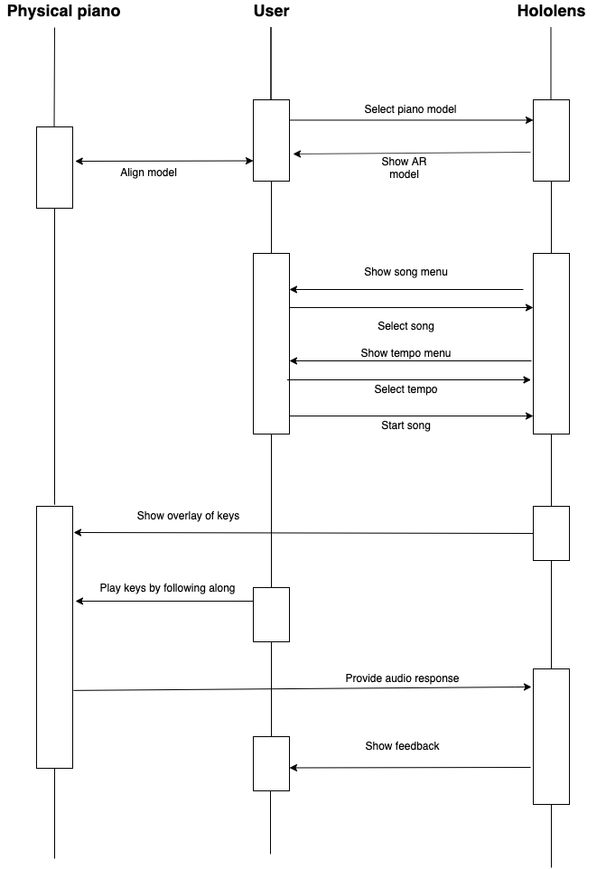
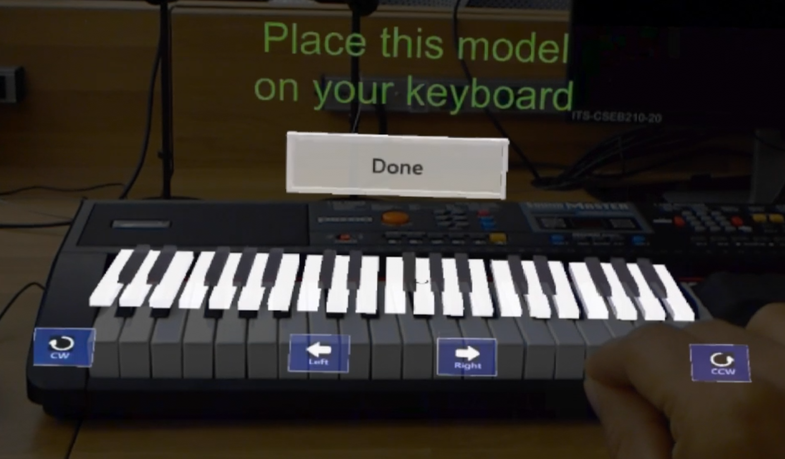
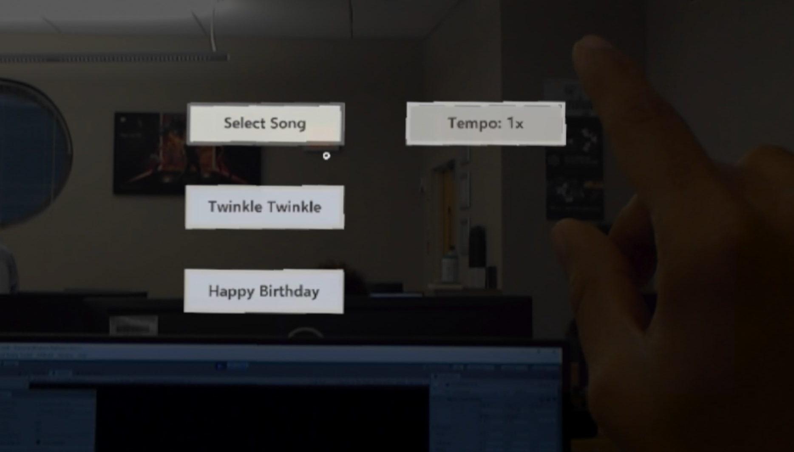
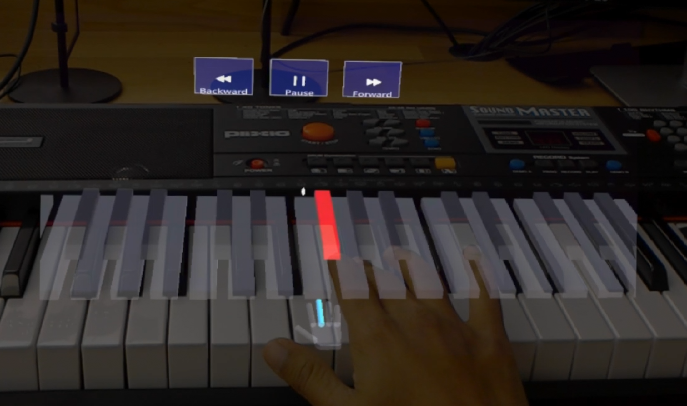

## PianoAR

An app that makes learning to play the piano much more fun and simple.

##### Developed by Team SAYAM
###### Mayank Rajoria, Yuvaraj Kakaraparthy, Sabrina Simao, Aveek Biswas, Sujith Chappidi, Akshansh Chahal

## Motivation

Being able to play the piano is cool. If you are able to play a song or two, that might also help to impress your friends at a party. But what if you are too busy with your schedule and do not have enough time to start learning the piano from the basics or try understanding the music sheets. There are plenty of video tutorials online that might help you learn a song. However, if you are using your laptop or tablet to play the tutorial, you always have to switch your gaze to and from the piano and the online interface. You also might need to stop or go back and forth in the tutorial to memorize the keys to play a certain tune and then replicate the same on the physical keyboard. This causes a lot of interruption in the learning process leading to frustration. This might decrease a beginner’s enthusiasm and make him quit.

So, we felt that there should be some way to help a novice get started very easily. In order to do so, we used Augmented Reality (AR) to show holographic projections on the physical piano to show which keys are to pressed in which order to play a particular song.

The problem stated above has already been identified and there are a few apps which do use AR to help teach playing the piano. However, in case of AR apps for mobiles, the user has to hold the phone in one hand with the camera projected on the piano. In this way, they are not able to use both hands to play any song. Moreover, it is also important to show the proper finger movements across the different keys so as to play the piano more efficiently. As per our knowledge, this aspect is ignored by all of the existing apps. Hence, we thought of building this PianoAR app which brings all these elements together at one place and creates a very smooth learning experience for a piano enthusiast.

## Design and System Architecture

We tried to make the UI as simple and intuitive as possible so that the user is not confused by too many options. Here is the flow diagram of how our app works:

Just after opening the app, the user sees the option of selecting a song they want to learn. The tempo is “1x” by default. But they can speed up or slow down the same accordingly. After selecting the song, the user has to align the keyboard hologram on the actual piano using hand gestures. The song starts after that following a countdown timer so as to provide the user some time to get ready. The holographic projections are color-coded (red for the black keys and green for the white ones) and there is small hand shown just below the keys to show which finger should be used to press that key.

Here are a few snapshots showing the app in action:

## Product Features

1.	A song menu where the user selects the song he wants to learn.
2.	A tempo menu to select the pace of the song being played.
3.	Buttons to help align the holographic keyboard easily with precision.
4.	Start, pause, rewind and forward buttons to practice while learning the song.
5.	A holographic hand showing which fingers are to be used to press a certain key.
6.	Use of different colors (red for black keys and green for the white ones) for the keyboard overlay to easily identify which keys to be pressed.

## Testing and Evaluation

We developed this product in multiple iterations incorporating user feedback after each iteration. The important feedbacks that we had got from the user-testing sessions are:
1.	Aligning the keyboard should be easier
2.	A countdown timer before the song starts so that the user can get ready after selecting the song
3.	Feedback on how the user actually played the song

We incorporated the first two suggestions but the feedback mechanism was added as future enhancement.

## Agile Development  process
The team followed the agile development process which helped in incorporating user feedback very quickly to the app. We used Zenhub and Github to keep track of the various issues that every member was working on.

## Equipment and Technologies used
1.	Microsoft Hololens
2.	Unity and Mixed Reality toolkit
3.	Zenhub and Github
